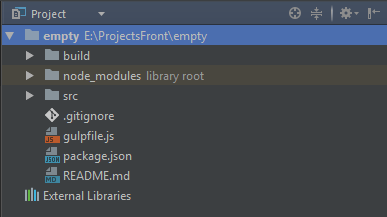

# Сборка Front-end проекта с использованием сборщика Gulp
Для сборки проектов используется сборщик Gulp. Соответственно у вас в системе должен быть установлен Node js. Установку ноды под конкретную платформу мы рассматривать не будем, т.к. это гуглится за пару минут. Что тако Gulp?

> [Gulp](http://gulpjs.com/) — это инструмент сборки веб-приложения, позволяющий автоматизировать повторяющиеся задачи, такие как сборка и минификация CSS- и JS-файлов, запуск тестов, перезагрузка браузера и т.д. Тем самым Gulp ускоряет и оптимизирует процесс веб-разработки. 

Если вы хотите понять как работает сборка с самого нуля, то [читаем тут](https://habrahabr.ru/post/250569/) или гуглим в интернете, а если же вам нужна готовая сборка, то смотрим [список используемых плагинов](#plugins), и оговый [gulpfile.js](#gulpfile), и приступаем к работе

#### Приступим!
Для корректной сборки у вас должны быть установлены node.js и npm. Так же вам нужно установить Gulp глобально себе на машину, для этого выполним команду:
```sh
$ npm install gulp-cli -g
``` 
Далее делаем Fork данной репы и клонирование соответственно, затем нам нужно установить наш gulp и плагины локально в папку проекта, из файла с зависимостями package.json, для этого нам нужно использовать такую команду:
```sh
$ npm install --save-dev
```
Если вы увидите команду ниже, не пугайтесь - это сокращённое написание ключей команды: 
```sh
$ npm i -D
```
Далее ждём пару минут когда всё установится. Когда всё наконец-таки установилось, у нас в проекте должна появиться папка node_modules и структура должна примерно выглядеть так:




#### Структура проекта:
В папке src хранятся наши исходные файлы, код и прочее, в папке build будет лежать наш собраный gulp`ом код, готовый к тестированию и продакшену.

#### Запуск сборщика:
Запустить сборку можно с помощью команды:
```sh
gulp
```
Таким образом запуститься дефолтная команда заданная в файле gulpfile.js. Так же в этом файле можно посмотреть все остальные команды.

<a name="plugins"></a>
#### Список плагинов:
Все плагины можно найти на [официальном сайте npm](https://www.npmjs.com/). Этот список все время будет изменяться, поэтому просьба следить за списком.

Название плагина  | Применение плагина
------------------|----------------------
[browser-sync](https://www.npmjs.com/package/browser-sync) | Самый нужный инструмент, с точки зрения повышения продуктивности веб-разработчиков. BrowserSync создает подключение, после чего производит автообновление страницы во всех браузерах на всех устройствах при изменениями не только клиентских или даже серверных файлов. А плюс ко всему синхронизирует позицию скроллинга и заполненные данные в формах
[gulp-notify](https://www.npmjs.com/package/gulp-notify) | Выводит ошибки при сборке Gulp в виде системных сообщений, а главное то, что работает для разных операционных систем.
[gulp-rename](https://www.npmjs.com/package/gulp-rename) | Переименовывает файлы, можно переименовывать суффикс, перфикс, имя файла, расширение файла
[gulp-rigger](https://www.npmjs.com/package/gulp-rigger) | Плагин позволяет импортировать один файл в другой простой конструкцией `//= footer.html`
[gulp-rimraf](https://www.npmjs.com/package/gulp-rimraf) | `rm -rf` для ноды
[gulp-sourcemaps](https://www.npmjs.com/package/gulp-sourcemaps) | Следит за изменением файлов и генирирует sours.map для файлов
[gulp-uglify](https://www.npmjs.com/package/gulp-uglify) | JavaScript компрессор
[gulp-csso](https://www.npmjs.com/package/gulp-csso) | CSS компрессор
[gulp-imagemin](https://www.npmjs.com/package/gulp-imagemin) | Минифицирует PNG, JPEG, GIF и SVG
[imagemin-pngquant](https://www.npmjs.com/package/imagemin-pngquant) | Дополнения к предыдущему плагину, для лучшей работы с PNG
[gulp-postcss](https://www.npmjs.com/package/gulp-postcss) | Инструмент позволяющий делать пост обработку файлов используя мелкие PostCSS плагины
[css-mqpacker](https://www.npmjs.com/package/css-mqpacker) | Группирует `media queries` и перемещает их в конец файла, есть возможность сортировки
[postcss-cssnext](https://www.npmjs.com/package/postcss-cssnext) | Позволяет использовать возможности CSS-4 уже сегодня. О возможностях CSS Next можно прочесть [в этой статье](https://habrahabr.ru/post/267181/)
[postcss-nested](https://www.npmjs.com/package/postcss-nested) | Позволяет писать вложенные селекторы, как это сделано в Sass и Less
[postcss-partial-import](https://www.npmjs.com/package/postcss-partial-import) | Реализует `@import` как в sass, то есть подтягивает импортируемый фйл в исходный и склеивает их 

<a name="gulpfile"></a>
#### Готовый gulpfile.js:
```js
'use strict';

// инициализируем наши плагины
var gulp = require('gulp'),
    uglify = require('gulp-uglify'),
    rigger = require('gulp-rigger'),
    imagemin = require('gulp-imagemin'),
    pngquant = require('imagemin-pngquant'),
    rimraf = require('rimraf'),
    rename = require("gulp-rename"),
    sourcemaps = require('gulp-sourcemaps'),
    browserSync = require("browser-sync"),
    notify = require( 'gulp-notify' ),
    mqpacker = require("css-mqpacker"),
    csso = require('gulp-csso'),
    postcss = require("gulp-postcss"),
    cssnext = require('postcss-cssnext'),
    partial = require('postcss-partial-import'),
    nested = require('postcss-nested'),
    short = require('postcss-short'),
    reload = browserSync.reload;

// Указываем пути, для лучшей коммуникации
var path = {
    build: { //Тут мы укажем куда складывать готовые после сборки файлы
        html: 'build/',
        js: 'build/js/',
        css: 'build/css/',
        img: 'build/img/',
        fonts: 'build/fonts/',
        lib: 'build/lib/'
    },
    src: { //Пути откуда брать исходники
        html: 'src/*.html',
        mainJs: 'src/js/main.js',
        vendorJs: 'src/js/vendor.js',
        mainStyle: 'src/css/main.pcss',
        vendorStyle: 'src/css/vendor.pcss',
        img: 'src/img/**/*.*',
        fonts: 'src/fonts/**/*.*',
        lib: 'src/lib/**/*.{png,svg,jpg,gif,JPEG}'
    },
    watch: { //Тут мы укажем, за изменением каких файлов мы хотим наблюдать
        html: 'src/**/*.html',
        mainJs: 'src/js/main.js',
        vendorJs: 'src/js/vendor.js',
        mainStyle: 'src/css/main.pcss',
        vendorStyle: 'src/css/vendor.pcss',
        img: 'src/img/**/*.*',
        fonts: 'src/fonts/**/*.*'
    },
    clean: './build',
    html: './build/*.html'
};

// Конфигурация сервера
var config = {
    server: {
        baseDir: "./build"
    },
    tunnel: true,
    host: 'localhost',
    port: 9000,
    logPrefix: "Frontend"
};

// Task на сборку html
gulp.task('html:build', function () {
    gulp.src(path.src.html) // Выберем файлы по нужному пути
        .pipe(rigger()) // Прогоним через rigger
        .pipe(gulp.dest(path.build.html)) // Выплюнем их в папку build
        .pipe(reload({stream: true})); // И перезагрузим наш сервер для обновлений
});

// Task на сборку основного файла с нашими js скриптами
gulp.task('mainJs:build', function () {
    gulp.src(path.src.mainJs) // Найдем наш main файл
        .pipe(sourcemaps.init()) // Инициализируем sourcemap
        .pipe(rigger()) // Прогоним через rigger
        .pipe(sourcemaps.write()) // Пропишем карты
        .pipe(gulp.dest(path.build.js)) // Выплюнем готовый файл в build
        .pipe(reload({stream: true})) // Перезагрузим сервер
        .pipe(uglify()) // Сожмем наш js
        .pipe(rename({suffix: '.min'})) // Добавим в имя файла суффикс .min
        .pipe(sourcemaps.write()) // Ещё раз пропишем карты, для минифицированного файла
        .pipe(gulp.dest(path.build.js)) // Выплюнем готовый минифицированный файл в build
        .pipe(reload({stream: true})); // И перезагрузим сервер
});

// Task на сборку js файла с вендорными скриптами
gulp.task('vendorJs:build', function () {
    gulp.src(path.src.vendorJs) // Найдем наш вендорный файл
        .pipe(sourcemaps.init()) // Инициализируем sourcemap
        .pipe(rigger()) // Прогоним через rigger
        .pipe(rename({suffix: '.min'})) // Добавим в имя файла суффикс .min
        .pipe(uglify()) // Сожмем наш js
        .pipe(sourcemaps.write()) // Пропишем карты
        .pipe(gulp.dest(path.build.js)) // Выплюнем готовый файл в build
        .pipe(reload({stream: true})); // И перезагрузим сервер
});

// Task на сборку основного файла с нашими стилями
gulp.task('mainStyle:build', function () {
    var processors = [
        nested,
        short,
        mqpacker({
            sort: true
        }),
        cssnext({browsers: ['last 25 version']})
    ]; // Подготовим наши postcss плагины

    gulp.src(path.src.mainStyle) // Найдем наш main файл
        .pipe(sourcemaps.init()) // Инициализируем sourcemap
        .pipe(postcss(processors)
            .on( 'error', notify.onError({
                message: "<%= error.message %>",
                title  : "PostCSS Error!"
            }))
        ) // Переберём наш файл с помощью postcss
        .pipe(sourcemaps.write()) // Пропишем карты
        .pipe(rename({
            extname: '.css'
        })) // Изменим расширение
        .pipe(gulp.dest(path.build.css)) // Выплюнем готовый файл в build
        .pipe(reload({stream: true})) // Перезагрузим сервер
        .pipe(csso())  // Сожмем наш css
        .pipe(rename({
            suffix: '.min',
            extname: '.css'
        })) // Изменим расширение и добавим суффикс
        .pipe(gulp.dest(path.build.css)) // Выплюнем готовый минифицированный файл в build
        .pipe(reload({stream: true})); // Перезагрузим сервер
});

// Task на сборку css файла с вендорными стилями
gulp.task('vendorStyle:build', function () {
    var processors = [
        partial,
        cssnext({browsers: ['last 25 version']})
    ]; // Подготовим наши postcss плагины

    gulp.src(path.src.vendorStyle) // Найдем наш вендорный файл
        .pipe(postcss(processors)
            .on( 'error', notify.onError({
                message: "<%= error.message %>",
                title  : "PostCSS Error!"
            }))
        ) // Переберём наш файл с помощью postcss
        .pipe(csso())  // Сожмем наш css
        .pipe(rename({
            suffix: '.min',
            extname: '.css'
        })) // Изменим расширение и добавим суффикс
        .pipe(gulp.dest(path.build.css)) // Выплюнем готовый минифицированный файл в build
        .pipe(reload({stream: true})); // Перезагрузим сервер
});

// Task на сборку и обработку картинок
gulp.task('image:build', function () {
    gulp.src(path.src.img) // Выберем все наши картинки
        .pipe(imagemin({
            progressive: true,
            svgoPlugins: [{removeViewBox: false}],
            use: [pngquant()],
            interlaced: true
        })) // Сожмем их
        .pipe(gulp.dest(path.build.img)) // И бросим в build
        .pipe(reload({stream: true})); // Перезагрузим сервер
});

// Task на сборку шрифтов. Так как мы пока ни как не обрабатываем шрифты, то просто копируем их
gulp.task('fonts:build', function() {
    gulp.src(path.src.fonts) // Выберем все наши шрифты
        .pipe(gulp.dest(path.build.fonts)) // И бросим в build
        .pipe(reload({stream: true})); // Перезагрузим сервер
});

// Task на сборку картинок из вендорных библиотек. Так как я пока не ришил как собирать все остатки картинок из различных библиотек, не используя bower, просто копирую их
gulp.task('libImages:build', function() {
    gulp.src(path.src.lib) // Выберем все вендорные картинки
        .pipe(gulp.dest(path.build.lib)) // И бросим в build
        .pipe(reload({stream: true})); // Перезагрузим сервер
});

// Task на build сборку
gulp.task('build', [
    'html:build',
    'mainJs:build',
    'vendorJs:build',
    'mainStyle:build',
    'vendorStyle:build',
    'image:build',
    'fonts:build',
    'libImages:build'
]);

// Task для отслеживания изменений в файлах
gulp.task('watcher',function(){
    gulp.watch(path.watch.html, ['html:build']);
    gulp.watch(path.watch.mainStyle, ['mainStyle:build']);
    gulp.watch(path.watch.vendorStyle, ['vendorStyle:build']);
    gulp.watch(path.watch.mainJs, ['mainJs:build']);
    gulp.watch(path.watch.vendorJs, ['vendorJs:build']);
    gulp.watch(path.watch.img, ['image:build']);
    gulp.watch(path.watch.fonts, ['fonts:build']);
});

// Task на наш Browser Sync
gulp.task('webserver', function () {
    browserSync(config);
});

// Task на отчистку папки build
gulp.task('clean', function (cb) {
    rimraf(path.clean, cb);
});

// Дефолтный task
gulp.task('default', ['build', 'webserver', 'watcher']);
```
